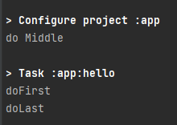

# gradle

# Gradle 학습

``` kotlin
task("hello"){
    doFirst{
        println("doFirst")
    }
    println("do Middle")
    doLast {
        println("doLast")
    }
}
```


출력 순서가 doMiddle->doFirst->doLast 순서로 출력된다.

명시적으로 순서를 지정하지 않으면 이해하기 어려울 수 있으니
웬만하면 doFirst, doLast 를 사용하는 것이 좋다

조금 구체적으로는 명시적으로 지정하지 않으면 configuration 단계에서
지정한다면 doFirst, doLast 를 사용하면 execution 단계에서 지정한다.
