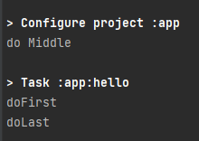
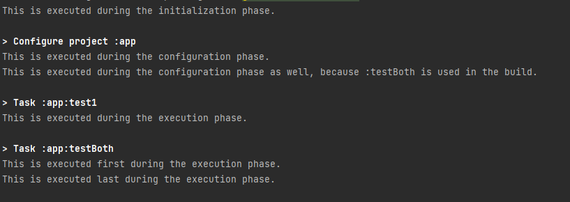

# gradle

# Gradle 학습

``` kotlin
tasks.register("hello"){
    doFirst{
        println("doFirst")
    }
    println("do Middle")
    doLast {
        println("doLast")
    }
}
```


출력 순서가 doMiddle->doFirst->doLast 순서로 출력된다.

명시적으로 순서를 지정하지 않으면 이해하기 어려울 수 있으니
웬만하면 doFirst, doLast 를 사용하는 것이 좋다

조금 구체적으로는 명시적으로 지정하지 않으면 configuration 단계에서
지정한다면 doFirst, doLast 를 사용하면 execution 단계에서 지정한다.

## 여러개 task를 한번에 실행하기

settings.gradle.kts
```kotlin
println("This is executed during the initialization phase.")
```
build.gradle.kts
``` kotlin
println("This is executed during the configuration phase.")

tasks.register("configured") {
    println("This is also executed during the configuration phase, because :configured is used in the build.")
}

tasks.register("test1") {
    doLast {
        println("This is executed during the execution phase.")
    }
}

tasks.register("testBoth") {
    doFirst {
        println("This is executed first during the execution phase.")
    }
    doLast {
        println("This is executed last during the execution phase.")
    }
    println("This is executed during the configuration phase as well, because :testBoth is used in the build.")
}
```

